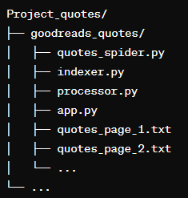
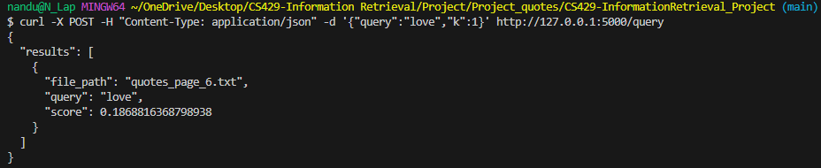
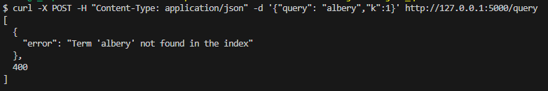

# CS429-InformationRetrieval

# Project Report

## Abstract

This project aims to develop a search engine for querying quotes and their authors. The primary objective is to create a scalable, efficient, and user-friendly system that allows users to search for quotes and get relevant results. The next steps involve enhancing the search capabilities, improving the user interface, and incorporating advanced features like sentiment analysis and user recommendations.

### Objectives:

1. Content Crawling with Scrapy:
- Implement a Scrapy-based web crawler capable of downloading web documents in HTML format.
- Provide initialization using a seed URL/domain, setting maximum pages to crawl, and maximum depth to explore.
- Implement concurrent crawling using AutoThrottle to optimize crawling speed.
2. Search Indexing with Scikit-Learn:
- Develop a Scikit-Learn-based indexer to construct an inverted index in pickle format.
- Compute TF-IDF scores/weights for document representation and implement Cosine similarity for document similarity calculation.
3. Query Processing with Flask:
- Create a Flask-based processor to handle free text queries in JSON format.
- Validate and error-check incoming queries and return top-K ranked results based on the indexed documents.

### Next Steps:

1. Content Crawling Enhancement:
- Explore distributed crawling capabilities using scrapyd for scalable crawling across multiple servers.
2. Search Indexing Advancements:
- Integrate vector embedding representations like word2vec to enrich document representation and improve search accuracy.
- Implement advanced neural/semantic kNN similarity using FAISS for enhanced semantic search capabilities.
3. Query Processing Improvements:
- Incorporate query spelling-correction and suggestion features using NLTK to handle potential query errors effectively.
- Integrate query expansion using WordNet to broaden the search scope and improve result relevancy.

## Overview

### Solution Outline

The solution involves a web scraping component that collects quotes and authors from source and save them into text files. These are the quotes_page_1 to quotes_page_100 with max 100 pages set and depth limit set as 2.An indexing component that creates an inverted index using TF-IDF scores, and a query processing and flask component that handles user queries and returns relevant results.

### Relevant Literature

- "Information Retrieval" by Christopher D. Manning, Prabhakar Raghavan, and Hinrich Schütze
- "Scrapy Documentation" for web scraping
- "Scikit-Learn Documentation" for TF-IDF and cosine similarity calculations

### Proposed System

The proposed system includes:

- Web scraping module using Scrapy
- Indexing module using Scikit-Learn
- Query processing module using Flask

## Design

### System Capabilities

- Web scraping of quotes and authors
- TF-IDF based indexing
- Cosine similarity based query processing
- RESTful API for querying

### Interactions

1. Web Crawling & Search Indexing Interaction:
- The Web Crawler (Scrapy) collects web documents and saves them into text files.These text files are then loaded and sent to indexer for indexing.
- The Indexer processes the crawled documents, computes TF-IDF scores/weights, and constructs an inverted index.
2. Search Indexing & Query Processing Interaction:
- Upon receiving a user query, the Query Processor (Flask) interacts with the Search Indexer and processor to retrieve relevant documents.
- The Indexer utilizes the inverted index to compute document similarities using Cosine similarity, enabling the Query Processor to return top-K ranked results to the user.

### Integration

- Scrapy for web scraping
- Scikit-Learn for TF-IDF and cosine similarity calculations
- Flask for web server and API

## Architecture

### Software Components

- **Web Scraping Module**: `quotes_spider.py`
- **Indexing Module**: `indexer.py`
- **Query Processing Module**: `processor.py`
- **Flask Module**:`app.py`

### File Structure

### Interfaces

- Web Interface
- RESTful API

### Implementation

- Python for backend development
- Scrapy for web scraping
- Scikit-Learn for TF-IDF calculations
- Flask for web server and API

## Operation

### Software Commands
#### Note: See to it that you are in correct directory inorder to run the code. The modules are present inside the goodreads_quotes folder.
- `scrapy runspider web_crawler.py`: Run the web scraping module. This will fetch 100 pages with 
- `python indexer.py`: Run the indexing module
- `python processor.py`: Run the processor module
- `python app.py`: Run the query processing module and start the Flask server

### Inputs
- `app.py`: Run the query processing module and start the Flask server
- `curl -X POST -H "Content-Type: application/json" -d '{"query": "life"}' http://127.0.0.1:5000/query` : This curl command will send a POST request to Flask server's /query endpoint with a JSON payload containing the query. The server will then process the query using the query_processor function and return the results as JSON with all the results.
- `curl -X POST -H "Content-Type: application/json" -d '{"query":"life", "k":5}' http://127.0.0.1:5000/query` : This curl command will send a POST request with a JSON payload containing both query and k parameters to the /query endpoint. The server will then process the query using the query_processor function and return the results as JSON with top 5 results. The value of k can be changed as needed.

### Installation

To install and set up the required software components, follow the installation instructions for each component:

1. Python 3.10+: Download and install Python from the official website: Python Official Website

2. Scrapy 2.11+: Install Scrapy using pip: `pip install scrapy`

3. Scikit-Learn 1.2+: `pip install scikit-learn`

4. Flask 2.2+: `pip install Flask`

5. Additional Libraries (Optional):
NLTK for query spelling-correction/suggestion: `pip install nltk`

WordNet for query expansion: `pip install wordnet`

or 

Install Required Libraries
Navigate to project directory in the terminal or command prompt and run the following command to install the required Python libraries:
`pip install -r requirements.txt`

## Conclusion

The project successfully developed a basic search engine for quotes. While the system performs well for simple queries, there is room for improvement in terms of scalability and search accuracy. Future work includes integrating more advanced search algorithms, enhancing the user interface, and optimizing performance.

## Data Sources

- Goodreads Quotes: [Link](https://www.goodreads.com/quotes)

## Test Cases
-  This is positive test case where the query is found and returns a similarity score with top most result. The k=1 gives the top result.

`curl -X POST -H "Content-Type: application/json" -d '{"query":"love","k":1}' http://127.0.0.1:5000/query`

- This is a negative test case where the query is not found and returns an error not found in index.

`curl -X POST -H "Content-Type: application/json" -d '{"query": "albert","k":1}' http://127.0.0.1:5000/query`

-  Additionally created a test case file named test_query_processor.py
This test case is designed to validate the functionality of the `query_processor` function in the `processor.py` module. The function takes a query, an inverted index, a TF-IDF matrix, and a list of file paths as inputs, and it returns the top-ranked documents based on cosine similarity scores.
### Running the Test: `python -m unittest test_query_processor.py`
Test Scenario
Input:
Query: "life"
Inverted index: A dictionary containing term-document mappings
TF-IDF matrix: A matrix containing TF-IDF scores for each document
File paths: A list of file paths corresponding to the documents

## Source Code

- All source code files are available in the project repository
- Documentation is included in the `README.md` file
- Open-source dependencies are listed in `requirements.txt` and are needed to be installed for the files to run.

## Bibliography

- Manning, C. D., Raghavan, P., & Schütze, H. "Information Retrieval."
- Scrapy Documentation. Available at: [Link](https://docs.scrapy.org/en/latest/)
- Scikit-Learn Documentation. Available at: [Link](https://scikit-learn.org/stable/documentation.html)